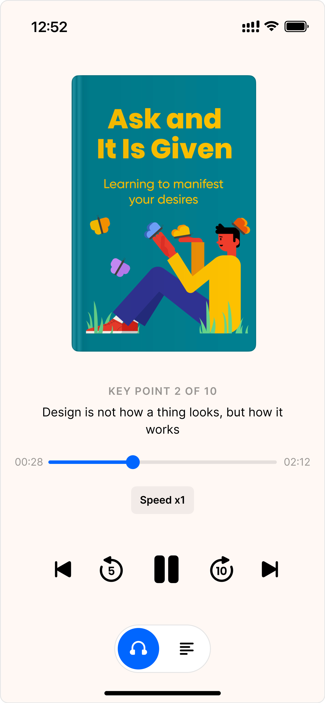

# BookPlayer

## Test Assignment


### As part of this test task, I developed a mini-application for listening to a book with the following functionality:

* Play/pause audio
* Switching between chapters of the book
* Adjusting playback speed
* Rewinding audio forward/backward by a certain time interval

### I used the following technologies:

* SwiftUI: For creating the UI
* Swift Concurrency: For asynchronous programming
* TCA: For creating a flexible architecture
* Unit testing for key components of the application

